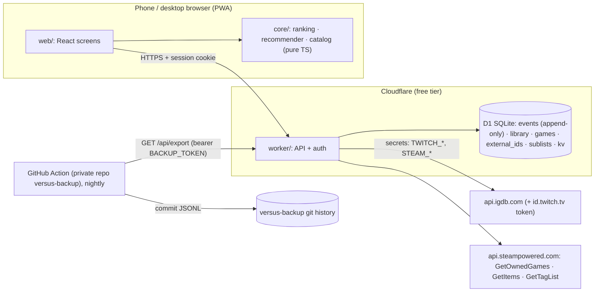

# versus — Design spec (v1)

Status: **draft for Bruno's review** · Date: 2026-10-06 · Supersedes nothing
Inputs: `docs/PRD.md` v0.1 · `docs/requirements-map.md` · `docs/data-source-verification.md` ·
throwaway spikes and simulations in `spikes/` (results in `spikes/results/`)

Evidence markers: ✅ verified (spike, simulation or official docs; source named) · ⚠️ assumption.

---

## 1. Summary

versus is a single-user **installable web app (PWA)**. You rank games you've played with Beli-style head-to-head questions, and it predicts how you'd rank games you haven't played, with an explanation.

- **Client:** the ranking engine and the recommender are **pure TypeScript running in the browser**.
- **Server:** a **Cloudflare Worker** stores an **append-only event log** in **D1 (SQLite)** and proxies IGDB and Steam, so no secret ever reaches the client.
- **Backups:** D1 Time Travel, a nightly export committed to a private GitHub repo, and a manual export button.
- **Running cost:** zero.

**v1 scope:** Steam import, triage, ranking, ranked list and sub-list views, backlog pick, predicted rank + explanation for any game you search, and export.
**v1.1:** discovery feed, candidate pool, scheduled refresh.

## 2. Scope

| Release | Requirements | Contents |
|---|---|---|
| **v1** | R-RANK-1–7, R-RANK-8a (manual re-rank), R-RANK-9a (filtered sub-lists) · R-DATA-1, -2, -3, -4a (cache + on-demand refresh), -6, -7 · R-REC-1, -3, -4, -5a ("already played → rank now"), -6 (amended), -7 (amended), -8 · R-LIB-1–3 · NF-1–7 | Everything needed to rank your library and decide what to play next |
| **v1.1** | R-REC-2, R-REC-5b (dismissals, filter-only), R-DATA-4b (scheduled refresh), R-DATA-5 | Discovery: candidate pool built and refreshed by a weekly GitHub Action |
| **Later** | R-RANK-8b (drift prompts, BT-disagreement hints), R-RANK-9b (own-criterion sub-lists), offline outbox, custom non-IGDB games, score-history view | Only once v1 is used for real |
| **Out** (PRD §5) | social, collaborative filtering, LLM features, deals, notes/hours, console library import, scraping | — |

### PRD amendments (agreed in the design session)

1. **R-REC-6:** the model learns from the **order derived from the comparison log** (its scores), not from the raw comparison pairs. ✅ In the simulation, raw-log training reached 0.56–0.58 held-out pairwise accuracy (chance = 0.5), versus 0.71–0.76 when training on the derived order (`spikes/results/sim_recommender_output.txt`). Binary insertion only asks about near-neighbours, so the raw log holds almost no strong contrasts.
2. **R-REC-7:** one model at every data size. Below 20 ranked games, predictions are labelled **low confidence**. There's no small-data kNN mode: the simulation showed the linear model ahead of kNN even at n = 10 (⚠️ synthetic taste is linear by construction). The only switch to kNN is the evaluation ship rule (§7.4), if real data shows ridge losing.
3. **R-RANK-3:** "too close" places the game directly below the pivot and logs a tie. There's no neighbour-pivot step (✅ sim Q3: equal accuracy, 13% fewer questions).
4. **R-RANK-8:** sanity-check comparisons move to Later (✅ sim: ≤ +0.01 Kendall τ per 100 extra questions, for all 4 strategies tried). In their place: a confirm screen after each insertion, plus manual re-rank.
5. **Status values:** add `inbox` (imported, not yet triaged) and `ignored` (never shown or recommended).
6. **Edition rule (R-DATA-6):** editions, bundles linked as editions, remasters, ports and expanded games collapse into their root work. Remakes and standalone expansions stay separate games.

## 3. Architecture



Why compute lives in the browser: ✅ Cloudflare Workers Free allows **10 ms CPU per request** (Workers limits docs). Fitting the model is trivial on a phone (n ≤ a few hundred), but too much for a Worker request.

**Stack:** TypeScript (strict) · Vite + React (UI) · plain `fetch` handler in the Worker (10 routes, no framework) · raw SQL against D1 · Vitest (unit, plus Worker tests on Cloudflare's local runtime) · Playwright (end-to-end, phone viewport) · Wrangler (deploy). **One npm package.** Code stays plain and commented for a learner (Bruno's stated level).

**Repo layout:**
```
src/core/ranking/      pure: events → order, insertion steps, scores
src/core/recommender/  pure: features, ridge, predict, explain, evaluate
src/core/catalog/      pure: normalize IGDB/Steam JSON, canonical work, duplicate hints, search rerank
src/worker/            Worker: routes, auth, db.ts (SQL), igdb.ts, steam.ts
src/web/               PWA: screens, api client, service worker, manifest
migrations/            D1 SQL migrations
tests/                 vitest (core, worker), e2e (playwright), fixtures (copied from spikes/fixtures)
scripts/eval.ts        offline evaluation CLI (npm run eval -- <export.json>)
```
**Boundary rule:** nothing under `src/core/` may import from `worker/` or `web/`, or use `fetch`, the DOM or D1. A test checks the import graph.

## 4. Modules and interfaces

```ts
// ---- shared types (src/core/types.ts) ----
type GameId = number;                       // IGDB id of the canonical (root) work
type Bucket = 'loved' | 'liked' | 'disliked';
type Status = 'inbox' | 'wishlist' | 'backlog' | 'playing' | 'played' | 'dropped' | 'ignored';
type AnswerResult = 'better' | 'worse' | 'tie';   // from the NEW game's point of view

interface GameMeta {
  id: GameId; name: string; year: number | null; gameType: number; coverImageId: string | null;
  genres: string[]; themes: string[]; keywords: string[]; modes: string[]; perspectives: string[];
  collections: string[]; developers: string[]; platforms: string[];
  totalRating: number | null; ratingCount: number;
  steamTags: { tagId: number; name: string; weight: number }[] | null;   // null = no Steam page
  ttb: { hastily: number; normally: number; completely: number; count: number } | null; // seconds
  versionParent: GameId | null; parentGame: GameId | null;
}

// ---- ranking (src/core/ranking) ----
function replay(events: RankEvent[]): RankState;
interface RankState {
  lists: Record<Bucket, GameId[]>;          // best first; the canonical order
  openSessions: Map<string, OpenSession>;   // session id → {game, bucket, answers (non-voided)}
  aliases: Map<GameId, GameId>;             // merged-from → into
}
function step(list: GameId[], answers: Answer[]):
  | { kind: 'ask'; pivot: GameId }
  | { kind: 'place'; below: GameId | null }  // null = top of bucket
  | { kind: 'stale' };                        // the list changed under this session → restart
function scores(state: RankState, bands?: Bands): Map<GameId, number>;

// ---- recommender (src/core/recommender) ----
function buildFeatures(train: GameMeta[], cfg?: FeatureConfig): FeatureSpace; // vocab + block layout
function vectorize(space: FeatureSpace, g: GameMeta, opts?: { maskSteam?: boolean }): Float64Array;
function fitRidge(X: Float64Array[], y: number[], lambda: number): RidgeModel;
function chooseLambda(X: Float64Array[], y: number[], grid?: number[]): number;  // inner 5-fold CV
function predict(m: RidgeModel, x: Float64Array): { score: number; contributions: Contribution[] };
function neighbours(x: Float64Array, ranked: { id: GameId; x: Float64Array }[], k: number): Neighbour[];
function confidence(input: ConfidenceInput): 'low' | 'medium' | 'high';
function recommend(state: RankState, scores: Map<GameId, number>, games: GameMeta[],
                   candidates: GameId[]): Prediction[];   // the one call the UI makes
function evaluate(dataset: EvalDataset, opts: { repeats: number; folds: number; seed: number }): EvalReport;

// ---- catalog (src/core/catalog) ----
function normalizeIgdb(raw: unknown): GameMeta;
function attachSteam(meta: GameMeta, items: unknown, tagNames: Map<number, string>): GameMeta;
function canonicalWork(id: GameId, lookup: (id: GameId) => GameMeta | undefined): GameId;
function duplicateHints(library: GameMeta[]): [GameId, GameId][];
function rerankSearch(hits: GameMeta[], query: string): GameMeta[];
```

**Worker HTTP API** (all routes except login require the session cookie; export also accepts the backup token):

| Route | Purpose |
|---|---|
| `POST /api/login` | passphrase → signed session cookie |
| `GET /api/events?since=<seq>` · `POST /api/events` | read the log · append a batch (idempotent on client UUID) |
| `GET /api/library` · `PUT /api/library/:id` | library rows + game metadata · update status/bucket/platforms |
| `GET /api/search?q=` | IGDB typeahead proxy |
| `POST /api/import/steam` | import/refresh owned games |
| `POST /api/games/:id` | fetch-or-refresh one game's metadata (used for searched games and the Refresh button) |
| `GET /api/export` | full JSON export (also used by the backup job) |

## 5. Data model (D1)

```sql
-- The crown jewels. Append-only: triggers forbid UPDATE and DELETE.
CREATE TABLE events (
  seq      INTEGER PRIMARY KEY AUTOINCREMENT,      -- total order of the log
  id       TEXT    NOT NULL UNIQUE,                -- client-generated UUID → idempotent retries
  ts       TEXT    NOT NULL,                       -- ISO-8601 UTC, client clock
  list_id  TEXT    NOT NULL DEFAULT 'global',      -- reserved for own-criterion sub-lists (Later)
  type     TEXT    NOT NULL CHECK (type IN ('session_started','answer','undo','session_cancelled',
                                              'placed','unranked','merged','unmerged')),
  game_id  INTEGER NOT NULL,                       -- the game being ranked / merged-from
  data     TEXT    NOT NULL DEFAULT '{}'           -- JSON payload, see below
);
CREATE TRIGGER events_no_update BEFORE UPDATE ON events BEGIN SELECT RAISE(ABORT, 'events are append-only'); END;
CREATE TRIGGER events_no_delete BEFORE DELETE ON events BEGIN SELECT RAISE(ABORT, 'events are append-only'); END;

CREATE TABLE games (
  id INTEGER PRIMARY KEY,            -- IGDB id
  root_id INTEGER NOT NULL,          -- canonicalWork(id); equals id for root works
  meta TEXT NOT NULL,                -- JSON GameMeta
  fetched_at TEXT NOT NULL
);
CREATE TABLE external_ids (source TEXT NOT NULL, uid TEXT NOT NULL, game_id INTEGER NOT NULL,
                           PRIMARY KEY (source, uid));          -- e.g. ('steam','1145360') → Hades
CREATE TABLE library (
  game_id INTEGER PRIMARY KEY,       -- canonical id
  status TEXT NOT NULL CHECK (status IN ('inbox','wishlist','backlog','playing','played','dropped','ignored')),
  bucket TEXT CHECK (bucket IN ('loved','liked','disliked')),   -- triage bucket; see rule below
  platforms TEXT NOT NULL DEFAULT '[]',
  source TEXT NOT NULL CHECK (source IN ('steam','manual')),
  steam_playtime_min INTEGER,
  added_at TEXT NOT NULL, updated_at TEXT NOT NULL
);
CREATE TABLE sublists (id TEXT PRIMARY KEY, name TEXT NOT NULL,
                       kind TEXT NOT NULL CHECK (kind IN ('filter','set')), filter TEXT, created_at TEXT NOT NULL);
CREATE TABLE sublist_items (sublist_id TEXT NOT NULL, game_id INTEGER NOT NULL, PRIMARY KEY (sublist_id, game_id));
CREATE TABLE kv (key TEXT PRIMARY KEY, value TEXT NOT NULL, expires_at TEXT);  -- IGDB token, last_backup_at
```

**Event payloads** (`data`):

| type | game_id | data |
|---|---|---|
| `session_started` | game being ranked | `{session, bucket}` |
| `answer` | game being ranked | `{session, pivot, result: 'better'\|'worse'\|'tie'}` |
| `undo` | game being ranked | `{session}`: voids the latest non-voided answer of that session |
| `session_cancelled` | game being ranked | `{session}` |
| `placed` | game being ranked | `{session, bucket, below: GameId \| null}` |
| `unranked` | game | `{}`: removes the game from the order (e.g. status back to backlog) |
| `merged` | from | `{into}` |
| `unmerged` | from | `{into}` |

**Bucket rule:** a ranked game's bucket is the bucket in its latest `placed` event. `library.bucket` is the triage bucket used while the game is still unranked, and the Worker updates it to match whenever it stores a `placed` event. A game is "unranked" if it has a bucket but no `placed` event in effect. It appears inside its bucket, marked unranked, with no score.

**Size check:** ~70 games × ~6 events per insertion ≈ 400 events for seeding. Even 10,000 events (about 5 MB including metadata) sit far inside D1's limits. ✅ D1 free: 5 GB, 100k writes per day.

## 6. Ranking engine

### 6.1 Insertion step (pure; it also drives undo and resume)

```
step(list, answers):                       # list = bucket order WITHOUT the game being ranked
  lo, hi = 0, len(list)                    # candidate insertion indexes are [lo, hi]
  for a in answers:                        # answers of the open session, voided ones removed
      mid = floor((lo + hi) / 2)
      if list[mid] != a.pivot: return STALE          # list changed since this answer
      if a.result == 'tie':  return PLACE(below = list[mid])
      if a.result == 'better': hi = mid
      else:                    lo = mid + 1
  if lo == hi: return PLACE(below = list[lo-1] if lo > 0 else null)
  return ASK(pivot = list[floor((lo + hi) / 2)])
```

- **Question count:** ⌈log₂(m+1)⌉ for a bucket of m games (✅ sim: ≤ 5 / 6 / 7 for libraries of 60 / 100 / 200).
- **Undo:** append `undo`. The session's answers lose their last element, and `step` recomputes. With no answers left, the UI returns to bucket choice.
- **Abort and resume:** do nothing. The session stays open in the log, and the next visit (any device) calls `step` with the stored answers.
- **Stale:** if another placement happened in that bucket meanwhile (e.g. on another device), the UI says so and restarts the session. The old answers remain as evidence.
- **Confirm screen:** after `PLACE`, show "Between *A* and *B*" with ✓ / **Redo**. ✓ appends `placed`. Redo cancels the session and starts a new one. ⚠️ This catches the main failure mode, a wrong early answer (✅ sim: at 5% answer error, the worst-placed game per run lands ~16 places off), only if Bruno recognizes a bad placement; it's untested with real use.
- **Re-rank** (R-RANK-8a) and **bucket change** both start a new session for a ranked game, using the target bucket's list without the game. The game keeps its old place until the new `placed`.

### 6.2 Order derivation: replay

```
replay(events):
  lists = {loved: [], liked: [], disliked: []}; sessions = {}; aliases = {}
  for e in events ordered by seq:
     g = resolve(aliases, e.game_id)
     switch e.type:
       session_started:   sessions[e.session] = {game: g, bucket: e.bucket, answers: []}
       answer:            sessions[e.session].answers.push(e)
       undo:              mark last non-voided answer of sessions[e.session] voided
       session_cancelled: delete sessions[e.session]
       placed:            remove g from every list
                          below = resolve(aliases, e.below)
                          i = (below == null) ? 0 : index_of(lists[e.bucket], below) + 1
                          if below != null and below not in lists[e.bucket]: i = len(list)   # defensive; logged
                          lists[e.bucket].insert(i, g); delete sessions[e.session]
       unranked:          remove g from every list
       merged:            aliases[g] = e.into
                          if g ranked and e.into unranked: e.into takes g's slot
                          remove g from every list
       unmerged:          delete aliases[g]   # g returns unranked; into keeps its slot
  return {lists, openSessions: sessions, aliases}
```

The order is a pure function of the log, so it's reproducible (R-RANK-5). Answers aren't used for ordering: they're kept as evidence for the Later "inconsistency" hints and for audit. **Bradley-Terry isn't used in v1** (✅ sim Q2: +0.004 τ over replay with buckets; not worth having the list move on its own).

### 6.3 Scores

Bands: loved [6.7, 10.0] · liked [3.4, 6.6] · disliked [0.0, 3.3]. For a bucket with n ranked games and position i (0 = best): `score = hi` if n = 1, else `hi − (hi − lo) · i / (n − 1)`. One decimal is shown. Scores move when games are added, and the ranked list says so in a one-line note (R-RANK-4).

### 6.4 Dropped games, triage, seeding

- **Dropped** is a status. A dropped game is ranked like any other, chooses its own bucket, and shows a "dropped" marker (R-RANK-6).
- **Triage** (R-RANK-7): imported `inbox` games are queued by **Steam playtime, highest first** (used for ordering only, never as a model feature). One tap per game: **Loved · Liked · Didn't like** (→ `played` + bucket), a **Dropped** toggle on those three, **Backlog · Playing · Ignore**. Duplicate hints show as a banner with a **Merge** button.
- **Ranking sessions:** "Rank 10" works through unranked games, highest playtime first. ✅ Sim: seeding ~65 games ≈ 200 questions; 100 games ≈ 383; 200 games ≈ 956 (3 buckets).

### 6.5 Sub-lists (v1)

`filter` sub-lists store a saved filter (platform / genre / year / status). `set` sub-lists store hand-picked games. Both display in **global order**. Own-criterion lists (separate log, `list_id ≠ 'global'`) are Later.

## 7. Recommender

### 7.1 Features

Built from the ranked games' metadata. Each block is scaled to **unit L2 norm per game**, so a game with 84 keywords doesn't outweigh one with 4.

| Block | Encoding | Filter | ✅ Size in Bruno's library (115 games) |
|---|---|---|---|
| genre, theme, mode, perspective | binary | — | 13 / 18 / 6 / 6 |
| keyword | binary | stop-list (`steam`, `digital distribution`, `steam achievements`, `achievements`, `steam cloud`, `steam trading cards`, `steam workshop`, `overlay`, `pc`, `windows`, `dlc`, `downloadable content`, `xbox one x enhanced`, `playstation trophies`, `online`) + used by ≥ 3 ranked games | 469 |
| steam_tag | tag weight ÷ the game's max tag weight | used by ≥ 3 ranked games | 161 |
| collection, developer | binary | used by ≥ 2 ranked games | — |
| consensus | IGDB `total_rating`, standardized; missing → 0 | — | 1 |
| has_steam_tags | 0/1 | — | 1 |

### 7.2 Model: ridge regression on the score

- **Target:** `y` = current score of each ranked game (§6.3). Center `X` and `y`, solve the dual `α = (XcXcᵀ + λI)⁻¹ (y − ȳ)` with a Cholesky solve (n × n, n = ranked games), then `w = Xcᵀ α` and `intercept = ȳ − x̄·w`. About 60 lines of TS, no library.
- **λ:** chosen from {0.1, 0.3, 1, 3, 10} by 5-fold CV on held-out pairwise accuracy, recomputed at each refit.
- **Refit:** on app load and after every `placed` event. ⚠️ Budget: < 200 ms on the phone. If that's exceeded, move fitting into a Web Worker.
- **Rejected alternatives:** pairwise logistic on derived-order pairs (✅ sim: +0.01–0.02 accuracy, weights in log-odds rather than score points); trees and boosting (not inspectable); kNN scorer (✅ sim: 0.61–0.70, below ridge everywhere).

### 7.3 Prediction, confidence and explanation

For a candidate c (backlog or wishlist game, or any searched game):

- **Score:** `clamp(intercept + w · x_c, 0, 10)`. The implied bucket is the band containing that score.
- **Neighbourhood:** the ranked games whose *actual* scores bracket the prediction ("between *Hades* 8.1 and *Celeste* 7.9").
- **Confidence** (rule, initial thresholds, tuned once real data exists):
  - `low` if ranked < 20, **or** max cosine similarity to any ranked game < 0.3, **or** < 50% of c's raw features are in the vocabulary;
  - `high` if ranked ≥ 40 **and** c has Steam tags **and** max similarity ≥ 0.5;
  - otherwise `medium`.
- **Why:** contributions `w_j · (x_cj − x̄_j)`, shown as the top 3 positive plus the top negative, with readable names ("Steam tag: Roguelite +0.6"). Plus the 3 most similar ranked games (cosine), each with rank and score, **including disliked ones**.
- **Backlog pick (R-REC-3):** `backlog` (optionally + `wishlist`) games sorted by predicted score. Filters: platform, genre, length (IGDB `normally`; shown as "~" when count < 5; ✅ 45/118 of Bruno's games have ≥ 5 submissions).
- **"Already played → rank now" (R-REC-5a):** sets the status to `played` and opens the ranking flow.

### 7.4 Offline evaluation protocol (R-REC-8)

`npm run eval -- <export.json>` (pure `evaluate()`, deterministic seeds):

1. Ranked games G (needs |G| ≥ 20, otherwise it reports "not enough data").
2. For seed r in 1..5: shuffle G; split into 5 folds. For each held-out fold H:
   - rebuild the order **without H** (drop H from the lists) and recompute scores, so held-out games don't leak into training targets;
   - build features from G \ H, choose λ by inner CV, fit;
   - predict H.
3. **Metrics:**
   - *pairwise accuracy*: over pairs (h ∈ H, t ∈ G \ H), does the order of `pred(h)` against `score(t)` agree with the true order of h and t? Pairs with equal predictions are skipped.
   - *Kendall τ*: between predictions and the true order within H.
   - Both are reported as mean and 95% bootstrap interval over the 25 folds.
4. **Subgroup:** the same metrics with Steam tags **masked** on held-out games (zero the block, `has_steam_tags = 0`), which simulates console games.
5. **Baselines** on the same folds: genre-average (mean training score of games sharing ≥ 1 genre, else the global mean), kNN-5 (cosine-weighted mean score), and IGDB `total_rating` alone.
6. **Ship rule:** the model must beat kNN-5 on pairwise accuracy. If it doesn't, the app scores with kNN-5 (same prediction, confidence and explanation UI; the contributions list is hidden) until a model that beats it exists. A model change ships only if mean pairwise accuracy drops by ≤ 0.01 **and** τ by ≤ 0.02 against the current model on the same seeds. CI runs the harness on a synthetic fixture so the harness itself stays tested.

## 8. Catalog and sync

- **Canonical ID:** the IGDB id of the root work. Steam appids are stored in `external_ids`. ✅ 118/121 of Bruno's Steam apps map 1:1 via IGDB `external_games` (`external_game_source = 1`). The 3 misses are software.
- **canonicalWork** (✅ link fields verified on BioShock Remastered, HL: Source, HLDM: Source, GTA V Enhanced and the Skyrim editions):
  ```
  canonicalWork(id): repeat up to 5 times:
     g = lookup(id)
     if g.versionParent:                                         id = g.versionParent   # editions
     elif g.gameType in {9 Remaster, 10 Expanded Game, 11 Port} and g.parentGame: id = g.parentGame
     else: return id
  ```
  Remakes (8) and standalone expansions (4) also have `parentGame`, and are deliberately **not** followed. The Worker fetches ancestors before calling it.
- **Duplicate hints:** library pairs that share an IGDB collection **and** whose names match after normalization (lower-case, strip punctuation and the suffixes "legacy", "enhanced", "remastered", "definitive", "special", "complete", "goty", "edition") → banner with **Merge**. ✅ Needed: Steam's "GTA V Enhanced" maps to IGDB *Bundle* 334647, which has no parent link, so the rule above can't catch it.
- **Search (R-DATA-1):** `search "<q>"; where game_type = (0,4,8,9,10) & version_parent = null; limit 20` with cover, year, rating_count. `rerankSearch` sorts by IGDB result order blended with `log10(1 + rating_count)`. The weight is tuned against fixture queries ("hades" → Supergiant's Hades first). 250 ms debounce, ≥ 2 characters. ⚠️ Typeahead hit rate is unmeasured; it's the main risk to NF-1.
- **Steam import (R-DATA-2):** GetOwnedGames → IGDB `external_games` (200 appids per query) → `games` (≤ 500 per query) + ancestors → Steam `GetItems` (tags, 50 apps per call) + `GetTagList` → `game_time_to_beats` → upsert.
  - New games → `inbox`; existing rows only get playtime updated.
  - When two appids collapse to the same root, the tags of the higher-playtime appid win.
  - ✅ ≈ 6 IGDB (incl. token and ancestors) + 5 Steam requests for 121 games, inside one Worker request (limit 50 subrequests).
- **Cache and freshness (R-DATA-4a):** metadata is stored only for games you touch. It's refreshed when you open a game whose `fetched_at` is > 30 days old, and by the Refresh button. Scheduled refresh comes in v1.1.
- **Rate limits:** ✅ IGDB 4 req/s, 8 concurrent; ✅ Steam 100k per day. The Worker retries 429 twice with backoff. The IGDB token (✅ ~60 days) is cached in `kv`.
- **Tags fallback:** `GetItems` sits behind a `TagSource` interface. SteamSpy (✅ works, 1 req/s) is the documented fallback, **not built in v1**.
- **Attribution (R-DATA-7):** footer "Game data: IGDB.com · Steam data via the Steam Web API". IGDB requires attribution only for commercial partners; Steam asks for a privacy statement → a short `/privacy` page.

## 9. Data-source decisions (evidence: `docs/data-source-verification.md`)

| Source | Decision | Key evidence |
|---|---|---|
| IGDB | **Primary catalog + IDs** | ✅ 98% Steam mapping, all metadata fields present, time-to-beat endpoint, caching encouraged, no CORS (→ Worker proxy) |
| Steam `GetOwnedGames` | **Library import** | ✅ 121 games, playtime in minutes |
| Steam `GetItems` + `GetTagList` | **User tags (top 20, weighted)** | ✅ 120/121 apps returned tags (114 the full 20); ⚠️ undocumented endpoint |
| SteamSpy | Fallback only (not built) | ✅ works, 1 req/s |
| RAWG | Not used | adds nothing; backlinks required |
| Backloggd, SteamDB, HowLongToBeat | Not used | no API / terms; IGDB covers time-to-beat |

## 10. Hosting, auth, secrets and backups (NF-2 to NF-5)

- **Hosting:** Cloudflare Workers Free. The Worker serves the static PWA assets and the API (⚠️ whether asset requests count toward the 100k/day request limit is unverified; irrelevant at single-user volume). D1 holds the data. ✅ 100k requests per day, 10 ms CPU per request, D1 5 GB / 100k writes per day, no sleeping. Supabase was rejected: ✅ free projects pause after 1 week of inactivity.
- **Auth (NF-4):** `POST /api/login` compares the passphrase with the `APP_PASSPHRASE` secret in constant time, then sets an HMAC-signed cookie (`HttpOnly; Secure; SameSite=Strict`, 90 days, key `SESSION_KEY`). After 5 failed attempts per hour, logins are refused.
- **Secrets (NF-3):**
  - Worker secrets (`wrangler secret put`): `TWITCH_CLIENT_ID`, `TWITCH_CLIENT_SECRET`, `STEAM_API_KEY`, `STEAM_ID64`, `APP_PASSPHRASE`, `SESSION_KEY`, `BACKUP_TOKEN`.
  - In the `versus-backup` GitHub repo: `BACKUP_TOKEN` and the Worker URL as Actions secrets.
  - Local dev: `.env` → `.dev.vars` (both git-ignored).
  - The Worker never logs request URLs to Steam, and a test asserts that error messages are redacted.
- **Durability (NF-5), three independent layers:**
  1. D1 Time Travel: ✅ restore to any minute in the last **7 days** (free plan).
  2. Nightly GitHub Action in a **private** repo `versus-backup`: `GET /api/export` → `events.jsonl` + `library.json` + `sublists.json` committed. The git history is the versioned off-site copy. ✅ GitHub auto-disables scheduled workflows only in *public* repos (after 60 days of inactivity). The Worker writes `last_backup_at` to `kv`, and Settings shows it **in red when it's older than 3 days**.
  3. Manual **Export** (R-LIB-3) → JSON, plus CSV of the ranked list.

  Restore = replay events into a fresh D1 (`scripts/restore.ts`), tested in CI with a fixture export.
- **Cost:** all inside free tiers. ✅ GitHub Actions: 2,000 minutes per month on private repos; the nightly backup job is expected to take < 1 min (⚠️).

## 11. Testing (NF-6)

| Layer | Tool | Must cover |
|---|---|---|
| core/ranking | Vitest | perfect oracle → exactly sorted list (seeded random libraries); `replay(log)` equals the live state after every action; undo + re-answer ≡ direct answer; tie placement; stale detection; merge/unmerge; scores at bucket edges (n = 0, 1, 2) |
| core/recommender | Vitest | ridge against a hand-solved 3×2 case; block normalization; stop-list; contributions sum to `score − baseline`; `evaluate()` on a synthetic fixture beats genre-average (the spike as a regression test); the Steam-mask subgroup runs |
| core/catalog | Vitest on **real fixtures** | BioShock Remastered → BioShock; Skyrim Anniversary → Skyrim (2-step chain); CS: Source stays separate; GTA V Legacy + Enhanced → duplicate hint; "hades" rerank; normalizeIgdb on the Outer Wilds fixture |
| worker | Vitest on Cloudflare's local runtime + local D1 | auth required everywhere; events append-only (UPDATE/DELETE fail); idempotent POST; import with mocked IGDB/Steam fixtures; Steam key never appears in an error body |
| e2e | Playwright, phone viewport (Pixel 7 profile) against `wrangler dev` + fixture-backed fake IGDB/Steam | login → import → triage 5 → search a game → bucket → answer ≤ 8 questions → confirm → score shown; undo; abort and resume after reload; backlog pick shows reasons; export downloads |
| manual | Bruno's S26 | install from Chrome; rank one real game in < 1 min (NF-1) |

CI: GitHub Actions on push (typecheck, vitest, playwright).

## 12. Risks

| Risk | Likelihood | Impact | Mitigation |
|---|---|---|---|
| Steam `GetItems` changes (undocumented) | medium | tags missing for new games | `TagSource` interface; SteamSpy fallback is documented; the model has `has_steam_tags` and works on IGDB alone |
| The real taste model doesn't beat kNN (the sim's taste was linear) | medium | weak recommendations | the eval harness decides; ship rule falls back to kNN-5 scoring with the same explanation UI |
| Console games are scored systematically differently (no Steam tags) | medium | biased predictions | masked-Steam subgroup metric; confidence capped at `medium` without tags |
| A wrong early answer misplaces a game by ~16 places | high (✅ sim) | wrong list | confirm screen with neighbours; Redo; manual re-rank |
| Typeahead returns the wrong game first | medium | NF-1 failure | filters + rerank + cover/year in results; fixture tests on known sloppy queries |
| Backup job silently stops | low | the 7-day window is the only net | `last_backup_at` shown in red after 3 days; GitHub failure emails (⚠️ default notification setting) |
| Cloudflare free-tier terms change | low | hosting | the stack is plain TS + SQLite; export/restore scripts make moving cheap |
| IGDB schema changes (an enum→table migration already happened) | medium | import breaks | `normalizeIgdb` is the only place that reads raw IGDB; fixture tests flag the drift |
| Learning curve: Bruno maintaining TS | medium | stalled project | plain code, few dependencies, pure core with tests as documentation |

## 13. Decision log

| # | Decision | Alternatives | Why |
|---|---|---|---|
| D1 | PWA | native Kotlin/Compose; TWA/Capacitor wrapper | one codebase covering phone + desktop; testable here with Playwright (no JDK or Android SDK on this machine); a wrapper adds nothing for a single user (Bruno chose it) |
| D2 | TypeScript everywhere, plain style | Python recommender + TS UI | Bruno isn't fluent in either; one toolchain; in-browser fitting needs JS anyway (Bruno chose it) |
| D3 | Cloudflare Worker + D1 | local-first IndexedDB; Supabase + Vercel; Render | no sleep or wipe, desktop sees the same data, free cron; ✅ Supabase pauses after 7 days; browser storage can be evicted |
| D4 | Compute in the browser | compute in the Worker | ✅ 10 ms CPU per request on Workers Free |
| D5 | Append-only event log enforced by triggers | mutable rank table | R-RANK-5; a bad deploy can't rewrite history |
| D6 | Order = replay of `placed` events | replay answers through binary search; Bradley-Terry fit | deterministic under re-rank and merge; ✅ BT +0.004 τ only |
| D7 | "Too close" = place below pivot + log a tie | neighbour pivot; true ties | ✅ same accuracy, 13% fewer questions; a strict order keeps the UI simple |
| D8 | Confirm screen instead of sanity checks | 4 sanity-check strategies | ✅ ≤ +0.01 τ per 100 questions; the confirm screen costs zero taps when the placement is right |
| D9 | Fixed bands 6.7–10 / 3.4–6.6 / 0–3.3 | percentile score; size-proportional bands | PRD default; "8 means loved" stays true |
| D10 | Sub-lists inherit the global order (v1) | own-criterion logs | YAGNI; `list_id` reserved in the log |
| D11 | Ridge on derived scores | logistic on raw log (PRD R-REC-6); logistic on order pairs; kNN; trees | ✅ raw log ≈ chance; ridge within 0.02 of best and weights read as score points |
| D12 | One model at all sizes, confidence label | kNN below 20 games | ✅ linear ≥ kNN even at n = 10 (⚠️ synthetic) |
| D13 | Block-normalized features + keyword stop-list + min-df | raw counts; TF-IDF | ✅ keywords range 0–84 per game; the top 3 keywords are distribution noise |
| D14 | IGDB id of the root work as canonical ID | own UUIDs | ✅ 98% mapping; non-IGDB games are rare (Later) |
| D15 | Collapse editions/remasters/ports/expanded; keep remakes/standalone expansions | merge remakes too; never auto-collapse | Bruno chose it; ✅ link fields verified |
| D16 | Duplicate hints + merge events | rely on IGDB links only | ✅ GTA V Enhanced (Bundle) has no link |
| D17 | Steam tags via official `GetItems` | SteamSpy primary | Valve host, batchable, same data; SteamSpy kept as fallback |
| D18 | Discovery feed in v1.1 | v1 | Bruno chose it; validate the model on real rankings first; removes the cron and pool from v1 |
| D19 | Playtime orders triage only | playtime as a taste feature | ✅ the top playtimes are sandbox/4X/live-service games; format ≠ enjoyment |
| D20 | Three backup layers incl. a private git repo | D1 Time Travel alone | NF-5: "losing the log is the worst failure"; the 7-day window is too short alone |
| D21 | Online-required ranking in v1 | offline outbox | answers are posted immediately and sessions resume from the server; the outbox is Later |

## 14. Bruno's setup tasks (cannot be done from here)

1. Create a free Cloudflare account; run `npx wrangler login` once on this machine.
2. Create the private GitHub repo `versus-backup`.
3. Choose the app passphrase (it goes into `wrangler secret put APP_PASSPHRASE`).
4. Keep the Steam profile's *Game details* public (✅ it is today).
